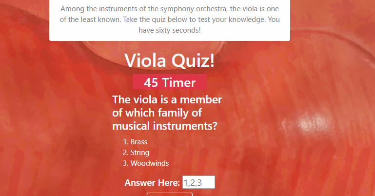

# Viola Quiz!

### This little app is a timed quiz.

### The subject of this quiz is a musical instrument -- the viola!

### The viola is unfamiliar to most people hence this quiz.

## Instructions

- The user first enters his/her initials which are stored in local storage
- Click the 'Start' button
- The user is presented with a question
- Once answered, either correctly or not, a new question is loaded
- A score appears at bottom
- A timer countsdowns from 60 seconds -- user has one minute to complete the quiz!
- Once completed, quiz resets

### Created with: HTML, CSS, JavaScript, jQuery, Bootstrap, Node.js, Mongo, PhotoShop

### Deployment: https://jaliov.github.io/Code-Quiz/
